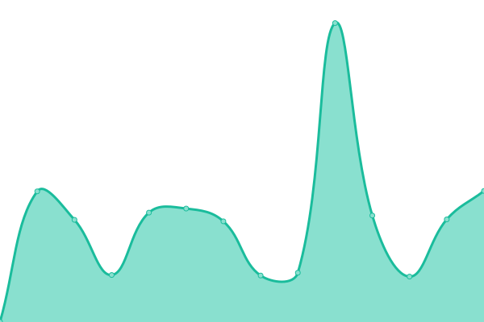
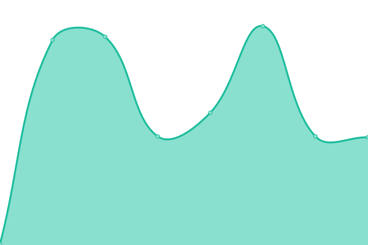

# [📈 Live Status](https://status.kreatea.space): <!--live status--> **🟩 All systems operational**

This repository contains the open-source uptime monitor and status page for [kreatoo](https://status.kreatea.space), powered by [Upptime](https://github.com/upptime/upptime).

With [Upptime](https://upptime.js.org), you can get your own unlimited and free uptime monitor and status page, powered entirely by a GitHub repository. We use [Issues](https://github.com/kreatoo/kreatea-status/issues) as incident reports, [Actions](https://github.com/kreatoo/kreatea-status/actions) as uptime monitors, and [Pages](https://status.kreatea.space) for the status page.

<!--start: status pages-->
<!-- This summary is generated by Upptime (https://github.com/upptime/upptime) -->
<!-- Do not edit this manually, your changes will be overwritten -->
<!-- prettier-ignore -->
| URL | Status | History | Response Time | Uptime |
| --- | ------ | ------- | ------------- | ------ |
|  [Main website](https://kreatea.space) | 🟩 Up | [main-website.yml](https://github.com/kreatoo/kreatea-status/commits/HEAD/history/main-website.yml) | 

 484ms
     
 | 

<a href="https://status.kreatea.space/history/main-website">100.00%</a>
    

|  [Gitea](https://git.kreatea.space) | 🟩 Up | [gitea.yml](https://github.com/kreatoo/kreatea-status/commits/HEAD/history/gitea.yml) | 

 599ms
     
 | 

<a href="https://status.kreatea.space/history/gitea">100.00%</a>
    

|  [Matrix (Synapse)](https://matrix.kreatea.space) | 🟩 Up | [matrix-synapse.yml](https://github.com/kreatoo/kreatea-status/commits/HEAD/history/matrix-synapse.yml) | 

 421ms
     
 | 

<a href="https://status.kreatea.space/history/matrix-synapse">100.00%</a>
    

|  [Libreddit](https://r.kreatea.space) | 🟩 Up | [libreddit.yml](https://github.com/kreatoo/kreatea-status/commits/HEAD/history/libreddit.yml) | 

 4686ms
     
 | 

<a href="https://status.kreatea.space/history/libreddit">100.00%</a>
    

|  [Nextcloud](https://cloud.kreatea.space) | 🟩 Up | [nextcloud.yml](https://github.com/kreatoo/kreatea-status/commits/HEAD/history/nextcloud.yml) | 

 1056ms
     
 | 

<a href="https://status.kreatea.space/history/nextcloud">100.00%</a>
    

|  [Searx](https://searx.kreatea.space) | 🟩 Up | [searx.yml](https://github.com/kreatoo/kreatea-status/commits/HEAD/history/searx.yml) | 

 186ms
     
 | 

<a href="https://status.kreatea.space/history/searx">100.00%</a>
    

|  [PrivateBin](https://bin.kreatea.space) | 🟩 Up | [private-bin.yml](https://github.com/kreatoo/kreatea-status/commits/HEAD/history/private-bin.yml) | 

 546ms
     
 | 

<a href="https://status.kreatea.space/history/private-bin">100.00%</a>
    

|  [Nitter](https://nitter.kreatea.space) | 🟩 Up | [nitter.yml](https://github.com/kreatoo/kreatea-status/commits/HEAD/history/nitter.yml) | 

 411ms
     
 | 

<a href="https://status.kreatea.space/history/nitter">100.00%</a>
    

|  [Vaultwarden](https://vault.kreatea.space) | 🟩 Up | [vaultwarden.yml](https://github.com/kreatoo/kreatea-status/commits/HEAD/history/vaultwarden.yml) | 

 426ms
     
 | 

<a href="https://status.kreatea.space/history/vaultwarden">100.00%</a>
    

<!--end: status pages-->

[**Visit our status website →**](https://status.kreatea.space)

## 📄 License

- Powered by: [Upptime](https://github.com/upptime/upptime)
- Code: [MIT](./LICENSE) © [kreatoo](https://status.kreatea.space)
- Data in the `./history` directory: [Open Database License](https://opendatacommons.org/licenses/odbl/1-0/)
